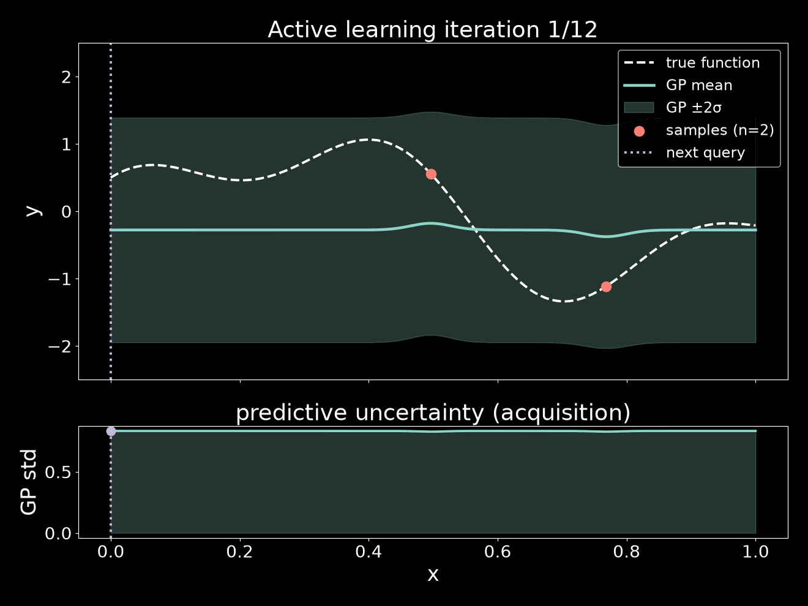

# Active Learning GP Demo

A minimal, self-contained demonstration of **active learning** with a
**Gaussian Process** (GP). A GP is trained on a known 1D function using an
increasing number of sampled points, where each new point is chosen at the
location of **maximum predictive uncertainty**. Every iteration is plotted and
the frames are stitched into an animated GIF.

Built with [gpytorch](https://gpytorch.ai/) (CPU only) and managed with
[pixi](https://pixi.sh/).



## The idea

Labelling data is expensive. Instead of sampling the target function on a dense
grid, active learning picks the *most informative* point to query next. For a
GP, a natural measure of "informativeness" is the model's own **predictive
uncertainty** (standard deviation): query where the model is least confident.

Each iteration:

1. Fit a fresh exact GP (RBF kernel) to the currently labelled points.
2. Predict mean and standard deviation over a dense grid.
3. **Acquisition:** pick the grid location with the largest std.
4. Label that point (evaluate the true function) and add it to the training set.

As points accumulate, the GP mean converges to the true function and the
uncertainty band collapses:

```
iter  1: n= 2  max std=0.834  -> query x=0.000
iter  2: n= 3  max std=0.775  -> query x=0.123
...
iter 12: n=13  max std=0.024  -> query x=0.837
```

The target function is `sin(6x) + 0.5·cos(14x)` on `[0, 1]`.

## Requirements

- [pixi](https://pixi.sh/) (all Python dependencies are handled for you)

Everything runs on **CPU** — no GPU required.

## Usage

```bash
# from the project directory
pixi run demo
```

This produces:

- `frames/iter_00.png` … `iter_11.png` — one plot per iteration (GP fit on top,
  the uncertainty/acquisition curve below).
- `active_learning.gif` — the full process as an animation.

## Configuration

Tweak the constants near the top of
[`active_learning_demo.py`](active_learning_demo.py):

| Variable        | Meaning                             | Default                  |
| --------------- | ----------------------------------- | ------------------------ |
| `true_function` | the target function to learn        | `sin(6x) + 0.5·cos(14x)` |
| `n_start`       | number of initial random points     | `2`                      |
| `n_iterations`  | number of active-learning steps     | `12`                     |

## Files

```
active_learning_demo.py   # the whole demo (model, AL loop, plotting, GIF)
pixi.toml                 # project + dependencies + `demo` task
pixi.lock                 # locked dependency versions
frames/                   # generated per-iteration PNGs
active_learning.gif       # generated animation
```

## Dependencies

Pinned in [`pixi.toml`](pixi.toml), all from `conda-forge`:
`pytorch-cpu`, `gpytorch`, `matplotlib`, `numpy`, `imageio`.
